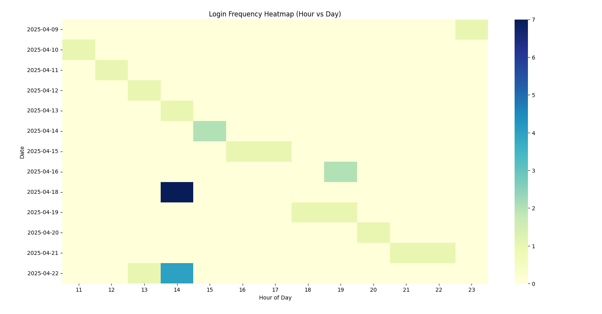
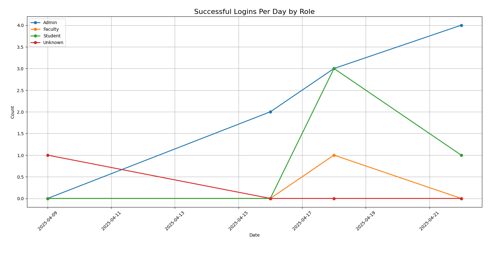
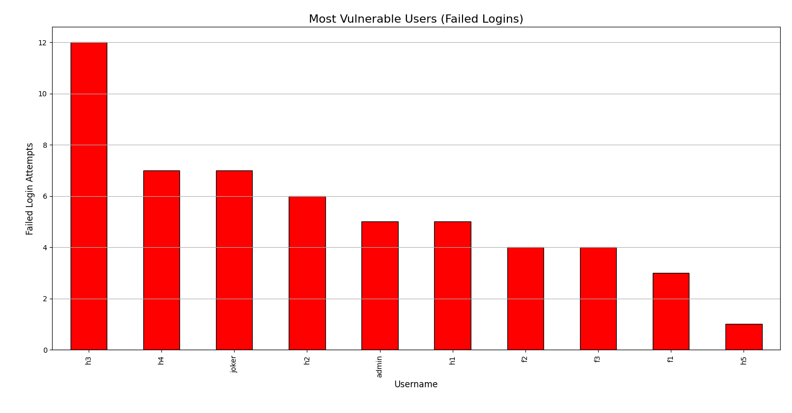

# Result Analysis – SDN-ZTN Project

This folder contains visualizations and analytical insights generated from system logs during the execution of our SDN-based Zero Trust Network (ZTN) implementation.

These graphs help in understanding usage patterns, threat behavior, login activity, and vulnerabilities across the system.

---

## 1. Login Frequency Heatmap (Hour vs Day)

**Description**:
- This heatmap shows the distribution of login attempts across hours and days.
- The darker the cell, the more frequent the logins during that hour on that date.

**Insight**:
- Peak login activity is observed around 14:00 to 16:00 hours.
- Helps admins identify busy hours for network access and schedule downtime accordingly.

---

## 2. Successful Logins Per Day by Role

**Description**:
- A line graph displaying login trends of different user roles over time.

**Legend**:
- 🟦 Admin
- 🟩 Student
- 🟧 Faculty
- 🟥 Unknown (failed/unregistered users)

**Insight**:
- Admin logins remain consistently high, indicating regular monitoring.
- Spikes in student activity correspond to assessment deadlines or academic usage.

---

## 3. Most Vulnerable Users (Failed Logins)

**Description**:
- Bar chart showing usernames with the highest number of failed login attempts.

**Insight**:
- Indicates potential brute force attempts or user confusion.
- Users like `h3`, `h4`, and `joker` should be reviewed and secured.
- This data triggers alerts and password reset notifications in the system.

---