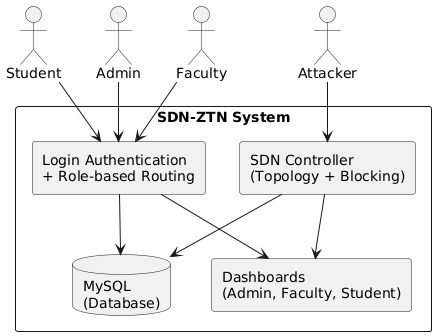
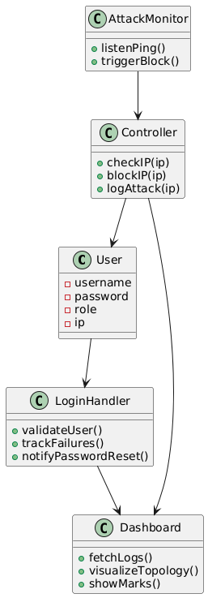
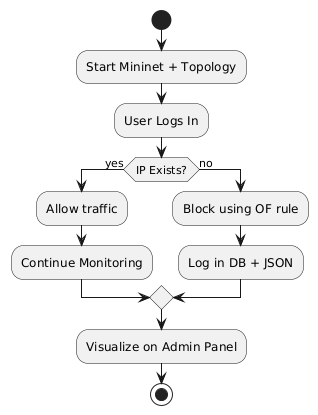
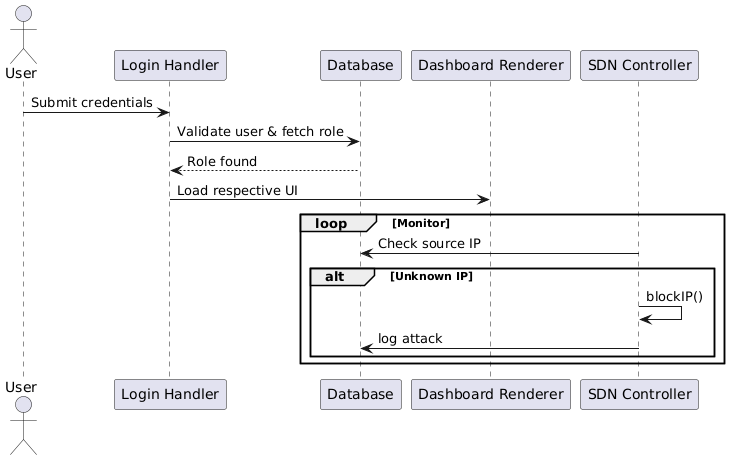

#  System Design - SDN-Based Zero Trust Network

This folder contains all the architectural design diagrams used to model and plan the SDN-based Zero Trust Network (ZTN) implementation. These diagrams were created using PlantUML and LaTeX formatting to guide and document the development process.

---

##  Diagrams Included

### 1. Context Diagram

- Shows the interaction between system users and external entities.
- Highlights Admin, Faculty, Students, Attackers, and their communication with the SDN controller.

### 2. Class Diagram

- Depicts key system entities like `User`, `LoginHandler`, `AttackLog`, and their relationships.
- Helps visualize data structure and backend logic.

### 3. Activity Diagram

- Illustrates how the SDN controller monitors, validates, and responds to network traffic.
- Emphasizes real-time blocking and alert generation on unknown IP activity.

### 4. Sequence Diagram

- Describes the interaction flow between users, the controller, and dashboards during login, network access, and attack detection.
- Useful for understanding the control logic and event ordering.

---

## Tools Used
- [PlantUML](https://plantuml.com/)
- LaTeX for documentation integration
- PNG/Markdown export for presentations

---

## Usage
You can refer to these diagrams for:
- Academic documentation
- GitHub project overview
- Presentations and Viva assessments

---